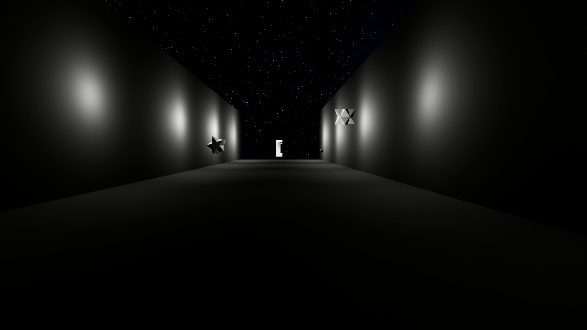

# Space-Scene-PC

An illusious game in space made for my thesis project.
#
This game contains illusions and visual tricks.
The goal is to find the way to move forward on the level. You know you beat the game when a counter appears. It means you finished the game in that amount of time.
 
## How to launch

The game is currently only available on a Windows 64-bit OS. However, most of the time 32-bit Windows is fine as well. To play the game, simply click on

`⬇ Code > Download ZIP`

After downloading, you should be able to unzip and launch the Illusion.exe file.

If an error with message starting like "Failed to open descriptor file" comes up, please navigate to [Space-Scene-PC/Illusion/Content/Paks/Illusion-WindowsNoEditor.pak](https://github.com/lyaflora/Space-Scene-PC/blob/main/Illusion/Content/Paks/Illusion-WindowsNoEditor.pak) here in the github repository, and press Download. Then replace the exisiting file on your PC in the same folder (Space-Scene-PC/Illusion/Content/Paks) with the downloaded file (Illusion-WindowsNoEditor.pak). It should start without complications now.